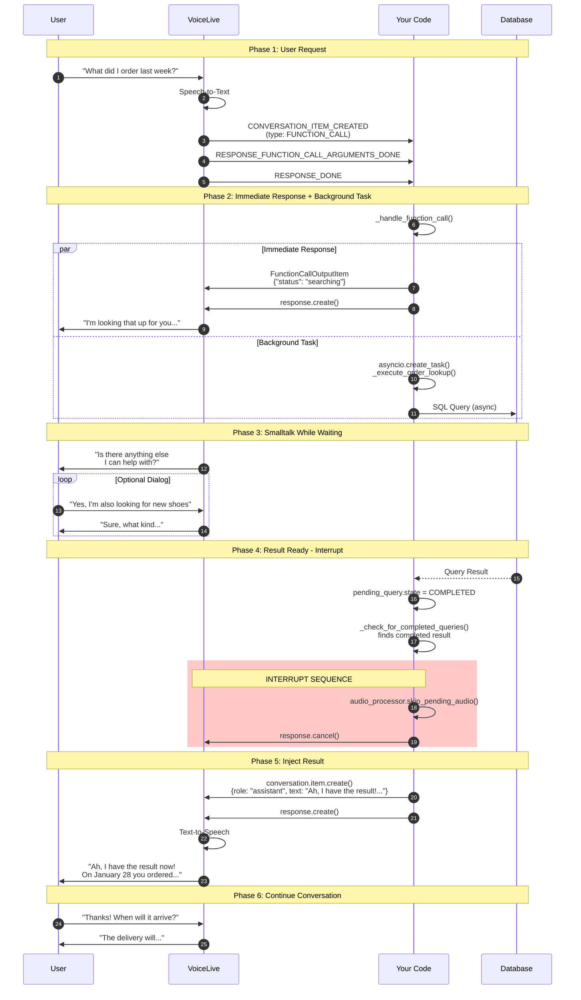

# AIFoundryVoiceAgent -- Async Voice Assistant with Background Queries

This example demonstrates an **async agent-powered voice assistant** using the Azure Voice Live API. It implements a pattern where tool calls (e.g., database lookups) run in the background while the assistant continues a natural conversation with the user -- and then interrupts with the result once it is ready.

---

## Architecture

The following diagram shows the full interaction flow between the user, Voice Live API, your application code, and the backend (database):



---

## How It Works

The core idea is a **non-blocking tool call pattern**:

1. **User asks a question** -- e.g., "What did I order last week?"
2. **VoiceLive triggers a tool call** -- the model decides it needs to call `lookup_order_history`.
3. **Immediate acknowledgement** -- your code sends back a quick `FunctionCallOutputItem` with `{"status": "searching"}` so VoiceLive can respond with "I'm looking that up for you..."
4. **Background task starts** -- `asyncio.create_task()` launches the real query (database, API, etc.) without blocking the event loop.
5. **Smalltalk continues** -- VoiceLive keeps the conversation flowing naturally.
6. **Result checker detects completion** -- a background loop polls every 500ms for completed queries.
7. **Interrupt and inject** -- when the result is ready, the code stops current audio, cancels any active response, and injects the result as an assistant message.

### Key Classes

| Class | Purpose |
|---|---|
| `AsyncAgentVoiceAssistant` | Main orchestrator. Manages the VoiceLive connection, handles events, dispatches tool calls, and injects background results. |
| `AudioProcessor` | Captures microphone input and plays back audio from VoiceLive using PyAudio. Supports immediate audio interruption via `skip_pending_audio()`. |
| `PendingQuery` | Tracks the state of each background query (PENDING, RUNNING, COMPLETED, INJECTED). |
| `QueryState` | Enum for query lifecycle states. |

### Simplified Flow

```
User speaks
    |
VoiceLive: Tool Call "lookup_order_history"
    |
IMMEDIATELY: FunctionCallOutputItem with {"status": "searching", ...}
    |
VoiceLive: "One moment, let me check..."
    |                                    |
Smalltalk continues            Background: DB Query runs
    |                                    |
    <------------- DONE! <---------------+
    |
INTERRUPT: skip_pending_audio() + response.cancel()
    |
INJECT: conversation.item.create(role="assistant")
    |
VoiceLive: "Ah, I have the result! On January 28 you ordered..."
```

---

## Setup

### Prerequisites

- Python 3.10+
- An Azure AI Foundry resource with the Voice Live API enabled
- A microphone and speakers (or headset)

### 1. Install Dependencies

```bash
cd AIFoundryVoiceAgent
pip install -r requirements.txt
```

> **Note on PyAudio:** On macOS you may need `brew install portaudio` first. On Ubuntu: `sudo apt-get install portaudio19-dev`.

### 2. Configure Environment

```bash
cp .env.example .env
```

Edit `.env` with your Azure credentials:

```env
AZURE_VOICELIVE_ENDPOINT=https://<your-resource>.services.ai.azure.com
AZURE_VOICELIVE_API_KEY=<your-api-key>
AZURE_VOICELIVE_MODEL=gpt-realtime
AZURE_VOICELIVE_VOICE=de-DE-ConradNeural
USE_TOKEN_CREDENTIAL=false
```

| Variable | Required | Description |
|---|---|---|
| `AZURE_VOICELIVE_ENDPOINT` | Yes | Your Azure AI Foundry endpoint |
| `AZURE_VOICELIVE_API_KEY` | Yes* | API key from the Azure portal |
| `AZURE_VOICELIVE_MODEL` | No | Model deployment name (default: `gpt-realtime`) |
| `AZURE_VOICELIVE_VOICE` | No | TTS voice (default: `de-DE-ConradNeural`) |
| `USE_TOKEN_CREDENTIAL` | No | Set `true` to use `az login` instead of API key |

*Not required if `USE_TOKEN_CREDENTIAL=true`.

### 3. Run

```bash
python main.py
```

Speak into your microphone. Ask about orders or search for products. The assistant will acknowledge your request immediately and deliver the result once the background query completes.

Press `Ctrl+C` to exit.

---

## Extending the Example

To add your own tools:

1. **Define the tool** in `_setup_session()` by adding a new `FunctionTool` to the `tools` list.
2. **Add a background executor** method (like `_execute_order_lookup`) that performs the actual work.
3. **Wire it up** in `_handle_function_call()` with a new `elif` branch that creates the async task.
4. Replace the simulated `asyncio.sleep()` calls with real database or API calls.

---

## License

See the [MIT License](../LICENSE) in the root of this repository.
