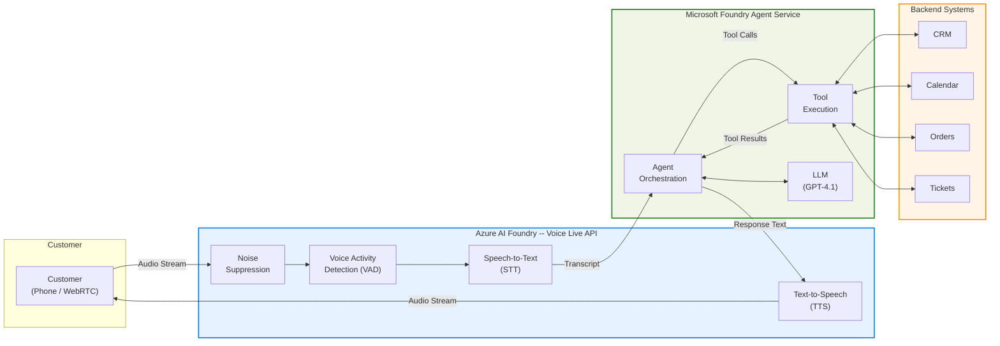

# Azure AI Foundry Voice Agent Demo

[](https://ai.azure.com/)

---

## What You'll Learn

If you're new to voice-enabled AI agents, this repository will teach you:

1. **What the Voice Live API does** -- how Azure turns speech into text and text back into speech in real time over a single WebSocket connection.
2. **What the Foundry Agent Service does** -- how Azure manages an LLM-powered agent that can reason about customer intents and call backend tools.
3. **How to connect them** -- two approaches: direct integration (Voice Live calls the agent automatically) or custom orchestration (your code bridges both).
4. **How to build tools** -- Python functions with type hints that the agent can call to query CRM, book appointments, check orders, or create support tickets.

Each concept is introduced progressively through four runnable examples.

---

## Overview

This repository demonstrates how to build an **intelligent Customer Service Voice Agent** by combining two powerful Azure AI capabilities:

- **Azure Speech in Foundry Tools (Voice Live API)** -- Real-time voice processing including speech-to-text, text-to-speech, voice activity detection, and noise suppression, all accessible as a unified streaming API.
- **Microsoft Foundry Agent Service** -- An orchestration layer that connects a large language model with custom tools, enabling the agent to reason about user intent and execute actions against backend systems in real time.

Together, these services enable a voice-driven agent that understands spoken language, reasons about the customer's request, executes tools (e.g., looking up an order, booking an appointment, creating a support ticket), and responds with natural-sounding speech -- all in a single, low-latency interaction loop.

---

## Business Case

### Why Voice Agents?

Traditional IVR (Interactive Voice Response) systems rely on rigid menu trees ("Press 1 for Sales, Press 2 for Support...") that frustrate customers and limit self-service capabilities. AI-powered voice agents represent a fundamental shift in how businesses handle phone-based customer interactions.

### Advantages Over Classic IVR

| Aspect | Classic IVR | AI Voice Agent |
|---|---|---|
| **Interaction Model** | Fixed menu trees, DTMF tones | Free-form natural language conversation |
| **Intent Recognition** | Keyword matching, limited grammar | LLM-powered semantic understanding of complex, multi-intent requests |
| **Flexibility** | Requires re-engineering for new flows | New capabilities via prompt updates and tool registration |
| **Context Awareness** | Stateless between menu levels | Maintains full conversation context across turns |
| **Tool Execution** | Pre-wired backend integrations | Dynamic tool selection and real-time execution based on conversation |
| **Escalation** | Blind transfer with no context | Seamless handoff with full conversation summary and gathered data |
| **Multilingual Support** | Separate trees per language | Native multilingual handling through a single model |
| **Customer Satisfaction** | Low -- repetitive, slow, impersonal | High -- natural, efficient, personalized |

By deploying this architecture, organizations can reduce average handle times, increase first-call resolution rates, and significantly improve customer experience -- while lowering operational costs compared to staffing large call center teams.

---

## Architecture Overview

The following diagram illustrates the end-to-end data flow from the customer's voice input through Azure AI services to backend systems and back.



**Data Flow Summary:**

1. The customer speaks into a phone or WebRTC-enabled browser.
2. The audio stream is sent to the **Voice Live API**, which applies noise suppression, detects voice activity, and transcribes the speech to text.
3. The transcript is forwarded to the **Foundry Agent Service**, where the LLM interprets the intent and decides which tools to invoke.
4. Tools execute against **backend systems** (CRM lookups, calendar bookings, order queries, ticket creation) and return structured results.
5. The agent composes a natural language response, which is synthesized into speech by the **Voice Live API** and streamed back to the customer.

---

## Key Features

- **Real-time voice streaming** -- Sub-second latency from speech input to spoken response using the Voice Live API's WebSocket-based protocol.
- **Natural language understanding** -- GPT-4.1 processes free-form customer requests without requiring rigid command structures.
- **Dynamic tool execution** -- The agent autonomously selects and invokes the right backend tools based on conversation context.
- **Voice Activity Detection (VAD)** -- Automatically detects when the customer starts and stops speaking, enabling natural turn-taking.
- **Noise suppression** -- Built-in audio enhancement ensures accurate transcription even in noisy environments.
- **Multi-turn conversation** -- Full conversation history is maintained so the agent can handle follow-up questions and multi-step workflows.
- **Seamless escalation** -- When the agent cannot resolve an issue, it hands off to a human operator with a complete conversation summary.
- **Extensible tool framework** -- Add new capabilities by registering additional tools without modifying the core agent logic.

---

## Repository Structure

```
AgenticWorkshopFeb26/
├── .env.example                        # Environment variable template
├── .gitignore                          # Git ignore rules
├── agents.md                           # Agent configuration and documentation
├── docker-compose.yml                  # Docker Compose for local services
├── pyproject.toml                      # Python project metadata and dependencies
├── README.md                           # This file
├── requirements.txt                    # Python dependencies
│
├── AIFoundryVoiceAgent/                # Standalone async voice assistant example
│   ├── main.py                         # Executable voice agent with background queries
│   ├── .env.example                    # Environment variable template
│   ├── requirements.txt                # Python dependencies
│   └── README.md                       # Setup and architecture documentation
│
├── voiceAgentAgentic/                  # Workshop: Local Tools → Agent SDK
│   ├── .env.example                    # Shared environment config
│   ├── requirements.txt                # Shared dependencies
│   ├── README.md                       # Workshop overview and comparison
│   ├── 01_local_tools/                 # Step 1: Voice Live + local tool execution
│   │   ├── main.py
│   │   └── README.md
│   └── 02_agent_tools/                 # Step 2: Voice Live + Agent SDK
│       ├── main.py
│       └── README.md
│
├── diagrams/                           # Architecture and flow diagrams
│
├── docs/                               # Additional documentation
│
├── examples/
│   ├── 01_voice_live_basic/            # Basic Voice Live API usage
│   ├── 02_agent_with_tools/            # Foundry Agent with tool integration
│   ├── 03_voice_agent_integration/     # Combining Voice Live + Agent Service
│   └── 04_customer_service_demo/       # Full customer service scenario
│
├── src/
│   ├── prompts/                        # System prompts and prompt templates
│   ├── tools/                          # Tool definitions (CRM, calendar, orders, tickets)
│   └── voice_agent/                    # Core voice agent implementation
│
└── tests/                              # Unit and integration tests
```

---

## Quick Start

### Prerequisites

- **Python 3.10+**
- **Azure Subscription** with access to:
  - Azure AI Foundry (formerly Azure AI Studio)
  - Azure Speech Service
  - An Azure AI Foundry Agent deployment
- **Azure CLI** (optional, for authentication)

### 1. Clone the Repository

```bash
git clone https://github.com/<your-org>/AgenticWorkshopFeb26.git
cd AgenticWorkshopFeb26
```

### 2. Install Dependencies

```bash
# Using pip
pip install -r requirements.txt

# Or using the project file
pip install -e .
```

### 3. Configure Environment Variables

Copy the example environment file and fill in your Azure resource details:

```bash
cp .env.example .env
```

Edit `.env` with your values (find them in the [Azure AI Foundry portal](https://ai.azure.com)):

```env
# Azure AI Foundry endpoint (from portal > your resource > Overview)
AZURE_FOUNDRY_ENDPOINT=https://<your-resource>.services.ai.azure.com

# Project name (from portal > your project)
PROJECT_NAME=<your-project-name>

# Model deployment name (from portal > Model Catalog > deploy a model)
MODEL_DEPLOYMENT_NAME=gpt-4.1

# TTS voice (optional, default: de-DE-ConradNeural)
VOICE_LIVE_VOICE=de-DE-ConradNeural
```

> **Authentication:** The application uses `DefaultAzureCredential`. Run `az login` locally. In production, use Managed Identity. See the [setup guide](docs/setup-guide.md) for details.

### 4. Run the Examples

Start with the basic examples and work your way up:

```bash
# Example 1: Basic Voice Live API connection
python examples/01_voice_live_basic/main.py

# Example 2: Agent with tools (text-only, no voice)
python examples/02_agent_with_tools/main.py

# Example 3: Voice + Agent integration
python examples/03_voice_agent_integration/main.py

# Example 4: Interactive customer service demo
python examples/04_customer_service_demo/main.py
```

#### Standalone Voice Example: Async Agent with Background Queries

A standalone voice assistant that demonstrates an **async tool call pattern** -- the assistant acknowledges requests immediately, runs queries in the background, and interrupts with results once ready:

```bash
cd AIFoundryVoiceAgent
cp .env.example .env   # fill in your Azure credentials
pip install -r requirements.txt
python main.py
```

See the [AIFoundryVoiceAgent README](AIFoundryVoiceAgent/README.md) for full setup instructions and architecture details.

### 5. Run with Docker (Optional)

```bash
docker-compose up --build
```

---

## Standalone Voice Example: AIFoundryVoiceAgent

A self-contained, runnable voice assistant that demonstrates an **async tool call pattern** using the Azure Voice Live API. While the examples in `examples/` build concepts progressively, this standalone project is ready to run on its own.

**What it does:** The assistant acknowledges tool requests immediately ("I'm looking that up..."), runs queries in the background, continues natural smalltalk, and then interrupts to deliver results once the background task completes.

```bash
cd AIFoundryVoiceAgent
cp .env.example .env   # fill in your Azure credentials
pip install -r requirements.txt
python main.py
```

| | |
|---|---|
| **Code** | [`AIFoundryVoiceAgent/main.py`](AIFoundryVoiceAgent/main.py) |
| **Full documentation** | [`AIFoundryVoiceAgent/README.md`](AIFoundryVoiceAgent/README.md) |
| **Architecture diagram** | Mermaid sequence diagram in the [AIFoundryVoiceAgent README](AIFoundryVoiceAgent/README.md#architecture) |
| **Configuration** | All settings via `.env` file -- see [`.env.example`](AIFoundryVoiceAgent/.env.example) |

---

## Voice Agent Workshop: Local Tools vs Agent SDK

A two-step workshop that teaches the progression from **local tool execution** to the **Azure AI Agent SDK**:

| Step | What It Does | Folder |
|---|---|---|
| **Step 1: Local Tools** | VoiceLive model decides tool calls, your code executes them locally | [`voiceAgentAgentic/01_local_tools/`](voiceAgentAgentic/01_local_tools/) |
| **Step 2: Agent SDK** | VoiceLive handles audio only, Agent SDK handles reasoning + tools | [`voiceAgentAgentic/02_agent_tools/`](voiceAgentAgentic/02_agent_tools/) |

Both steps use the same 8 customer service tools from `src/tools/`. Step 2 adds the Azure AI Agent Service for better reasoning, persistent conversation threads, and centralized tool management.

```bash
cd voiceAgentAgentic
cp .env.example .env   # fill in your Azure credentials
pip install -r requirements.txt

# Run Step 1 (Voice Live + local tools)
python 01_local_tools/main.py

# Run Step 2 (Voice Live + Agent SDK)
python 02_agent_tools/main.py
```

See the [voiceAgentAgentic README](voiceAgentAgentic/README.md) for full architecture diagrams and comparison.

---

## Example Scenarios

The following scenarios demonstrate typical customer service interactions handled by the voice agent. All example dialogues are in German to reflect the primary demo language.

---

### Szenario 1: Terminbuchung (Appointment Booking)

> **Kunde:** "Hallo, ich wuerde gerne einen Beratungstermin vereinbaren."
>
> **Agent:** "Guten Tag! Ich helfe Ihnen gerne dabei, einen Beratungstermin zu buchen. Darf ich zuerst Ihren Namen und Ihre Kundennummer erfahren?"
>
> **Kunde:** "Mein Name ist Mueller, Kundennummer 4711."
>
> **Agent:** *(ruft CRM-Tool auf, um Kundendaten abzurufen)* "Vielen Dank, Herr Mueller. Ich sehe, Sie sind seit 2021 bei uns Kunde. Haben Sie einen bevorzugten Tag und eine Uhrzeit fuer den Termin?"
>
> **Kunde:** "Am liebsten naechsten Mittwoch, nachmittags."
>
> **Agent:** *(ruft Kalender-Tool auf, um Verfuegbarkeit zu pruefen)* "Am Mittwoch, dem 5. Februar, haette ich um 14:00 Uhr und um 15:30 Uhr noch Termine frei. Welcher passt Ihnen besser?"
>
> **Kunde:** "14 Uhr waere perfekt."
>
> **Agent:** *(bucht Termin ueber Kalender-Tool)* "Wunderbar, ich habe Ihren Beratungstermin fuer Mittwoch, den 5. Februar um 14:00 Uhr eingetragen. Sie erhalten in Kuerze eine Bestaetigungs-E-Mail. Kann ich sonst noch etwas fuer Sie tun?"
>
> **Kunde:** "Nein, das war alles. Vielen Dank!"
>
> **Agent:** "Sehr gerne, Herr Mueller. Ich wuensche Ihnen einen schoenen Tag. Auf Wiedersehen!"

**Tools used:** `crm_lookup`, `calendar_check_availability`, `calendar_book_appointment`

---

### Szenario 2: Bestellstatus (Order Status)

> **Kunde:** "Guten Tag, ich moechte wissen, wo meine Bestellung bleibt."
>
> **Agent:** "Guten Tag! Das pruefe ich sofort fuer Sie. Koennten Sie mir bitte Ihre Bestellnummer nennen?"
>
> **Kunde:** "Die Bestellnummer ist B-2024-98765."
>
> **Agent:** *(ruft Bestell-Tool auf)* "Ich habe Ihre Bestellung gefunden. Sie haben am 20. Januar drei Artikel bestellt. Das Paket befindet sich aktuell im Versandzentrum Frankfurt und wird voraussichtlich am 31. Januar bei Ihnen eintreffen."
>
> **Kunde:** "Kann ich die Lieferadresse noch aendern?"
>
> **Agent:** *(prueft Aenderungsmoeglichkeit)* "Da das Paket bereits im Versandzentrum ist, kann die Adresse leider nicht mehr geaendert werden. Ich kann aber eine Umleitung ueber den Paketdienstleister veranlassen. Soll ich das fuer Sie einrichten?"
>
> **Kunde:** "Ja bitte, die neue Adresse ist Hauptstrasse 42, 60311 Frankfurt."
>
> **Agent:** *(erstellt Umleitungsauftrag)* "Die Umleitung an die Hauptstrasse 42 in Frankfurt ist eingerichtet. Sie erhalten eine SMS mit dem aktualisierten Tracking-Link. Gibt es noch etwas, wobei ich Ihnen helfen kann?"

**Tools used:** `order_status_lookup`, `order_check_modification`, `order_redirect_delivery`

---

### Szenario 3: Beschwerde (Complaint)

> **Kunde:** "Ich moechte mich beschweren. Das Geraet, das ich letzte Woche erhalten habe, funktioniert nicht."
>
> **Agent:** "Das tut mir sehr leid zu hoeren. Ich moechte Ihnen so schnell wie moeglich helfen. Koennten Sie mir bitte Ihre Kundennummer und die Bestellnummer des Geraets nennen?"
>
> **Kunde:** "Kundennummer 8832, Bestellnummer B-2024-54321."
>
> **Agent:** *(ruft CRM- und Bestell-Tools auf)* "Vielen Dank, Frau Schmidt. Ich sehe die Bestellung -- es handelt sich um einen kabellosen Lautsprecher, geliefert am 22. Januar. Koennten Sie mir kurz beschreiben, was genau nicht funktioniert?"
>
> **Kunde:** "Er laesst sich einschalten, aber es kommt kein Ton raus. Ich habe schon alles versucht -- Bluetooth neu verbunden, zurueckgesetzt, nichts hilft."
>
> **Agent:** *(erstellt Support-Ticket)* "Ich verstehe, das ist natuerlich aergerlich. Ich habe ein Support-Ticket mit der Nummer T-2024-11234 fuer Sie erstellt. Da der Lautsprecher innerhalb der Garantiezeit ist, biete ich Ihnen zwei Optionen an: Erstens, einen kostenlosen Austausch mit Expressversand. Oder zweitens, eine vollstaendige Rueckerstattung. Was waere Ihnen lieber?"
>
> **Kunde:** "Einen Austausch bitte."
>
> **Agent:** *(initiiert Austauschprozess)* "Der Austausch ist veranlasst. Sie erhalten morgen ein Ruecksendelabel per E-Mail und das Ersatzgeraet wird parallel versendet. Die voraussichtliche Lieferzeit betraegt zwei bis drei Werktage. Ihr Ticket lautet T-2024-11234, falls Sie den Status verfolgen moechten. Gibt es noch etwas, das ich fuer Sie tun kann?"
>
> **Kunde:** "Nein, danke fuer die schnelle Hilfe."
>
> **Agent:** "Sehr gerne, Frau Schmidt. Nochmals Entschuldigung fuer die Unannehmlichkeiten. Ich wuensche Ihnen einen schoenen Tag!"

**Tools used:** `crm_lookup`, `order_status_lookup`, `ticket_create`, `order_initiate_exchange`

---

## Azure Documentation Links

### Voice Live API

| Resource | Link |
|---|---|
| Overview | [Voice Live API Overview](https://learn.microsoft.com/en-us/azure/ai-services/speech-service/voice-live) |
| Quickstart | [Voice Live Quickstart](https://learn.microsoft.com/en-us/azure/ai-services/speech-service/voice-live-quickstart) |
| API Reference | [Voice Live API Reference](https://learn.microsoft.com/en-us/azure/ai-services/speech-service/voice-live-api-reference) |
| How-To Guide | [Voice Live How-To](https://learn.microsoft.com/en-us/azure/ai-services/speech-service/voice-live-how-to) |
| Agent Integration | [Voice Live Agents Quickstart](https://learn.microsoft.com/en-us/azure/ai-services/speech-service/voice-live-agents-quickstart) |
| FAQ | [Voice Live FAQ](https://learn.microsoft.com/en-us/azure/ai-services/speech-service/voice-live-faq) |
| Model Catalog Entry | [Azure Speech Voice Live -- Model Catalog](https://ai.azure.com/catalog/models/Azure-Speech-Voice-Live) |

### Azure Speech in Foundry Tools

| Resource | Link |
|---|---|
| Product Page | [Azure AI Foundry -- Speech Tools](https://azure.microsoft.com/en-us/products/ai-foundry/tools/speech) |
| Speech Service Documentation | [Azure Speech Service Docs](https://learn.microsoft.com/en-us/azure/ai-services/speech-service/) |

### Microsoft Foundry Agent Service

| Resource | Link |
|---|---|
| Overview | [Foundry Agent Service Overview](https://learn.microsoft.com/en-us/azure/ai-foundry/agents/overview) |
| Quickstart | [Foundry Agent Quickstart](https://learn.microsoft.com/en-us/azure/ai-foundry/agents/quickstart) |
| SDK Overview | [Azure AI Foundry SDK Overview](https://learn.microsoft.com/en-us/azure/ai-foundry/how-to/develop/sdk-overview) |
| Python SDK Reference | [Azure AI Agents Python SDK](https://learn.microsoft.com/en-us/python/api/overview/azure/ai-agents-readme) |
| Tools Overview | [Agent Tools Overview](https://learn.microsoft.com/en-us/azure/ai-foundry/agents/how-to/tools-classic/overview) |
| Agent Types | [Agent Types Reference](https://learn.microsoft.com/en-us/agent-framework/user-guide/agents/agent-types/) |

### Microsoft Foundry (General)

| Resource | Link |
|---|---|
| Azure AI Foundry Docs | [Azure AI Foundry Documentation](https://learn.microsoft.com/en-us/azure/ai-foundry/) |
| Getting Started with Code | [Foundry Quickstart -- Get Started with Code](https://learn.microsoft.com/en-us/azure/ai-foundry/quickstarts/get-started-code) |

### Azure AI Workshop

| Resource | Link |
|---|---|
| Build Your First Agent Workshop | [Agent Service Workshop](https://microsoft.github.io/build-your-first-agent-with-azure-ai-agent-service-workshop/) |

---

## Technology Stack

| Layer | Technology | Purpose |
|---|---|---|
| **Voice Interface** | Azure Voice Live API | Real-time STT, TTS, VAD, noise suppression |
| **Agent Orchestration** | Microsoft Foundry Agent Service | Intent routing, tool selection, conversation management |
| **Language Model** | GPT-4.1 (via Azure AI Foundry) | Natural language understanding and response generation |
| **Backend Integration** | Custom Python Tools | CRM, calendar, order, and ticket system connectors |
| **Runtime** | Python 3.10+ | Application runtime |
| **SDK** | Azure AI Agents SDK (Python) | Programmatic access to Foundry Agent Service |
| **Streaming Protocol** | WebSocket | Low-latency bidirectional audio streaming |
| **Containerization** | Docker / Docker Compose | Local development and deployment |

---

## License

This project is licensed under the [MIT License](LICENSE).

```
MIT License

Copyright (c) 2025

Permission is hereby granted, free of charge, to any person obtaining a copy
of this software and associated documentation files (the "Software"), to deal
in the Software without restriction, including without limitation the rights
to use, copy, modify, merge, publish, distribute, sublicense, and/or sell
copies of the Software, and to permit persons to whom the Software is
furnished to do so, subject to the following conditions:

The above copyright notice and this permission notice shall be included in all
copies or substantial portions of the Software.

THE SOFTWARE IS PROVIDED "AS IS", WITHOUT WARRANTY OF ANY KIND, EXPRESS OR
IMPLIED, INCLUDING BUT NOT LIMITED TO THE WARRANTIES OF MERCHANTABILITY,
FITNESS FOR A PARTICULAR PURPOSE AND NONINFRINGEMENT. IN NO EVENT SHALL THE
AUTHORS OR COPYRIGHT HOLDERS BE LIABLE FOR ANY CLAIM, DAMAGES OR OTHER
LIABILITY, WHETHER IN AN ACTION OF CONTRACT, TORT OR OTHERWISE, ARISING FROM,
OUT OF OR IN CONNECTION WITH THE SOFTWARE OR THE USE OR OTHER DEALINGS IN THE
SOFTWARE.
```
