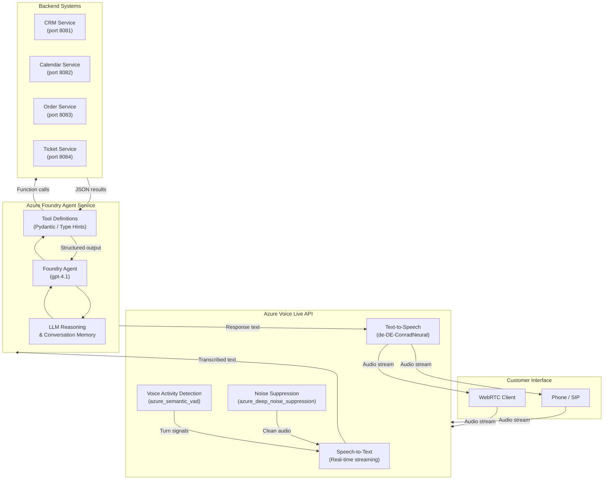

# Architecture Overview

## Introduction

This document describes the architecture of the Azure AI Foundry Voice Agent Demo. The system implements a customer service voice agent that accepts spoken input from callers (via phone or WebRTC), processes it through Azure's real-time speech pipeline, reasons over the request using a Foundry Agent backed by a large language model, executes business-logic tools, and responds with natural-sounding speech -- all within a single, low-latency conversation loop.

Understanding the architecture is essential before diving into the code because every design decision -- from the choice of WebSocket transport to the separation of agent logic from backend systems -- follows directly from the requirements of real-time, tool-augmented voice conversations.

---

## System Overview

The demo consists of four logical layers:

| Layer | Responsibility | Key Technology |
|---|---|---|
| **Customer Interface** | Captures and plays audio (phone / WebRTC client) | Browser WebRTC, SIP trunk |
| **Voice Live API** | Real-time speech-to-text (STT), text-to-speech (TTS), voice activity detection (VAD), noise suppression | Azure Speech in Foundry Tools |
| **Foundry Agent Service** | Intent understanding, multi-turn conversation management, tool orchestration | Azure AI Foundry Agent SDK |
| **Backend Systems** | Domain data -- CRM, calendar, orders, tickets | REST micro-services (mocked with Docker Compose in this demo) |

---

## Architecture Diagram



---

## Component Descriptions

### Voice Live API

The [Voice Live API](https://learn.microsoft.com/en-us/azure/ai-services/speech-service/voice-live) provides the real-time speech processing layer. It exposes a WebSocket endpoint that the client connects to for bidirectional audio streaming:

```
wss://<resource>.services.ai.azure.com/voice-live/realtime?api-version=2025-10-01
```

It bundles four capabilities into a single connection:

| Capability | Purpose |
|---|---|
| **Speech-to-Text (STT)** | Converts incoming audio frames into text with low latency. Partial (interim) results are emitted so the agent can begin reasoning before the caller finishes speaking. |
| **Text-to-Speech (TTS)** | Synthesises the agent's text response into audio using a selected neural voice (e.g., `de-DE-ConradNeural` for natural-sounding German). |
| **Voice Activity Detection (VAD)** | Detects when the caller starts and stops speaking. The `azure_semantic_vad` mode uses a semantic model that understands pauses within sentences vs. actual turn endings. |
| **Noise Suppression** | The `azure_deep_noise_suppression` mode removes background noise from the audio stream before it reaches STT, improving transcription accuracy in noisy call-centre environments. |

> **Reference:** [Azure Speech in Foundry Tools -- Product page](https://azure.microsoft.com/en-us/products/ai-foundry/tools/speech)

### Foundry Agent Service

The [Azure AI Foundry Agent Service](https://learn.microsoft.com/en-us/azure/ai-foundry/agents/overview) manages the conversational intelligence. An *agent* is a stateful entity that holds:

- A **model deployment** (e.g., `gpt-4.1`) for language understanding and generation.
- **System instructions** that define the agent's persona (e.g., "You are a helpful German-speaking customer service agent").
- **Tool definitions** the model can invoke at runtime.
- **Conversation memory** managed automatically across turns in a *thread*.

The demo creates and configures the agent via the `azure-ai-agents` Python SDK.

### Tools

Tools are plain Python functions annotated with `Annotated` type hints and Pydantic `Field` metadata. The SDK serialises the function signatures into JSON schemas that the LLM sees, so it can decide when and how to call them.

```python
# Example: a tool the agent can call to look up an order
from typing import Annotated
from pydantic import Field

def get_order_status(
    order_id: Annotated[str, Field(description="The order ID to look up")]
) -> dict:
    """Retrieve the current delivery status for the given order."""
    # ... call the Orders backend ...
```

In the demo the following tools are defined:

| Tool | Backend | Purpose |
|---|---|---|
| `crm_tool` | CRM Service | Identify customer, retrieve customer profile |
| `calendar_tool` | Calendar Service | Check availability, book appointments |
| `order_tool` | Order Service | Look up order status, list recent orders |
| `ticket_tool` | Ticket Service | Create support tickets, escalate issues |

### Backend Systems

The backends are simple REST services. In production these would be real enterprise systems; the demo provides Docker-based mock services (see `docker-compose.yml`) that return static or randomised data so you can run the full flow locally without external dependencies.

---

## Data Flow

A complete turn proceeds as follows:

1. **Audio in** -- The customer speaks. Raw PCM16 audio frames travel over the WebSocket to Voice Live.
2. **Noise suppression** -- `azure_deep_noise_suppression` cleans the signal.
3. **VAD** -- `azure_semantic_vad` determines when the caller has finished their turn.
4. **STT** -- The cleaned audio is transcribed to text.
5. **Agent reasoning** -- The transcribed text is sent to the Foundry Agent. The LLM decides whether to respond directly or call one or more tools.
6. **Tool execution** -- If the agent calls a tool, the tool function runs (calling the appropriate backend service) and returns its result to the agent.
7. **Response generation** -- The agent composes a text response incorporating the tool results.
8. **TTS** -- Voice Live synthesises the response text into audio.
9. **Audio out** -- The synthesised PCM16 audio is streamed back to the customer over the WebSocket.

### Example dialogue (German)

```
Kunde:  "Guten Tag, wo ist meine Bestellung Nummer 12345?"
         ↓ Audio → STT → Agent
Agent:  → crm_tool.identify_customer(phone_number="+49...")
        → order_tool.get_order_status(order_id="12345")
        ← { "status": "in_delivery", "eta": "morgen 10-14 Uhr" }
Agent:  "Ihre Bestellung ist unterwegs und wird morgen zwischen 10 und 14 Uhr geliefert."
         ↓ TTS → Audio → Kunde
```

---

## Security Considerations

| Area | Approach |
|---|---|
| **Authentication** | Uses `DefaultAzureCredential` from the `azure-identity` SDK, which supports managed identity in production and Azure CLI / environment credentials during development. API key authentication is available as a fallback. |
| **Transport encryption** | The WebSocket connection to Voice Live uses `wss://` (TLS). All backend calls use HTTPS in production. |
| **Secrets management** | Credentials are stored in environment variables (`.env` file locally, Azure Key Vault or App Configuration in production). The `.env` file is listed in `.gitignore`. |
| **Data residency** | Choose an Azure region that meets your data residency requirements. Audio data is processed in real time and not stored by the Voice Live API unless you explicitly enable logging. |
| **Role-based access** | Use Azure RBAC to grant least-privilege access to the AI Foundry resource and the Speech Service. |

---

## Troubleshooting Hints

- **WebSocket connection rejected (401/403):** Verify that your `DefaultAzureCredential` has the correct role assignments on the AI Foundry resource. Run `az login` locally or check managed identity configuration in production.
- **High STT latency:** Ensure the Voice Live API region matches the region of your client to minimise network round-trip time.
- **Agent does not call tools:** Check that the tool definitions are correctly registered when creating the agent. The LLM relies on the JSON schema generated from the Python type hints.
- **No audio output:** Confirm that `output_audio_format` is set to `pcm16` and that the client is playing the received audio frames at the correct sample rate (24000 Hz).

---

## Further Resources

- [Azure AI Foundry Documentation](https://learn.microsoft.com/en-us/azure/ai-foundry/)
- [Voice Live API Overview](https://learn.microsoft.com/en-us/azure/ai-services/speech-service/voice-live)
- [Foundry Agent Service Overview](https://learn.microsoft.com/en-us/azure/ai-foundry/agents/overview)
- [Azure Speech in Foundry Tools -- Product page](https://azure.microsoft.com/en-us/products/ai-foundry/tools/speech)
- [Build Your First Agent Workshop](https://microsoft.github.io/build-your-first-agent-with-azure-ai-agent-service-workshop/)
