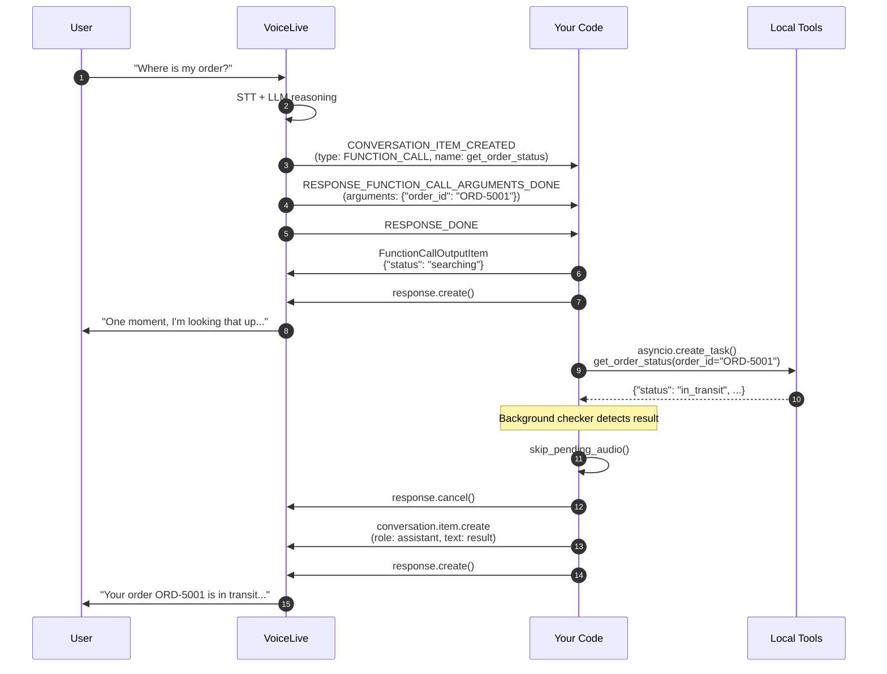

# Step 1: Voice Live with Local Tool Execution

In this step, the **VoiceLive realtime model** handles everything: speech recognition, reasoning, tool selection, and speech synthesis. Your code only needs to **execute the tools locally** and return the results.

---

## Architecture



## How It Works

1. **Tool schema conversion** -- The `python_func_to_voicelive_tool()` helper introspects `Annotated[str, Field(description=...)]` type hints from `src/tools/` and builds JSON schemas that VoiceLive understands.

2. **Tool dispatch** -- A dictionary maps function names to callables: `{"get_order_status": get_order_status, ...}`. When VoiceLive triggers a tool call, the code looks up the function and executes it.

3. **Async background pattern** -- Tool execution runs in the background via `asyncio.create_task()`. A poller checks every 500ms for completed results and injects them into the conversation.

## What to Notice

- **8 real tools** from `src/tools/` are registered on the VoiceLive session
- The VoiceLive model (gpt-realtime) decides which tool to call based on the user's speech
- Tools execute **locally** in your Python process -- no external agent service needed
- Conversation memory is limited to the VoiceLive session context

## Setup

```bash
cd voiceAgentAgentic
cp .env.example .env   # fill in Voice Live credentials
pip install -r requirements.txt
cd 01_local_tools
python main.py
```

Only the `AZURE_VOICELIVE_*` variables are needed for this step.
