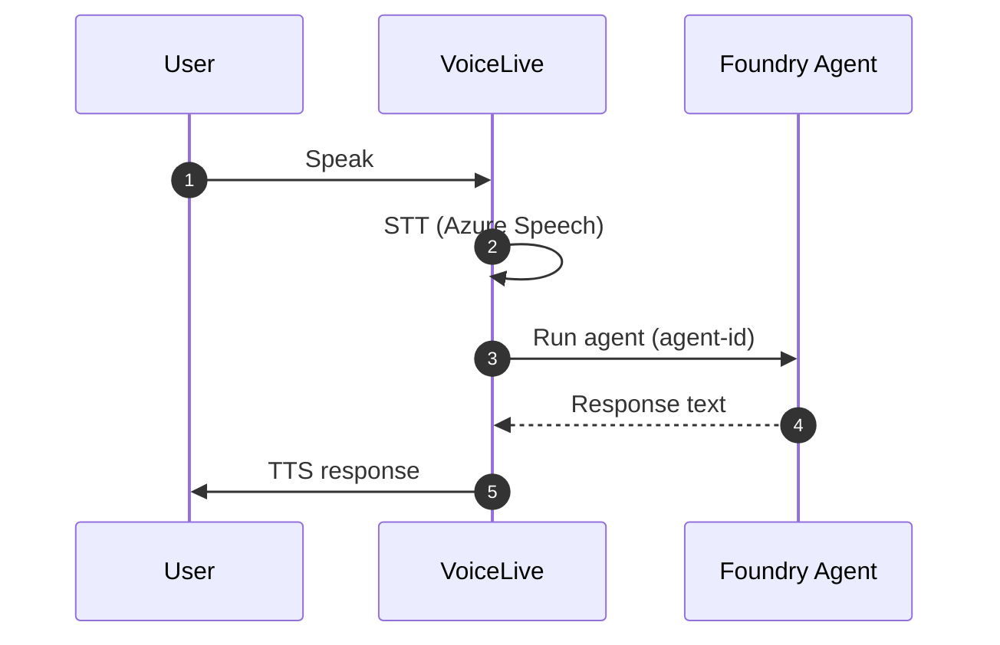

# Step 2: Voice Live + Foundry Agent (VoiceLive calls the agent)

In this step, **VoiceLive handles audio** (STT/TTS) and **calls an existing Foundry agent** directly. Your code does **not** create agents or run the Agent SDK manually.

---

## Architecture



## Setup

```bash
cd voiceAgentAgentic
cp .env.example .env   # fill in VoiceLive + Agent settings

pip install -r requirements.txt
az login

cd 02_agent_tools
python main.py
```

## Required environment variables

| Variable | Purpose |
|---|---|
| `AZURE_VOICELIVE_ENDPOINT` | VoiceLive endpoint |
| `AZURE_VOICELIVE_AGENT_ID` | Existing Foundry agent ID (e.g. asst_...) |
| `AZURE_VOICELIVE_PROJECT_NAME` | Foundry project name |
| `AZURE_VOICELIVE_VOICE` | Voice name (optional) |
| `AZURE_VOICELIVE_API_KEY` | API key (optional if using token) |
| `USE_TOKEN_CREDENTIAL` | `true` to use Azure CLI auth |

## Notes

- VoiceLive uses `agent-id`, `agent-project-name`, and an `agent-access-token` to invoke the agent.
- The agent must already exist in Foundry.
- If you only have the **agent name**, you must still provide the **agent ID** (usually `asst_...`).
