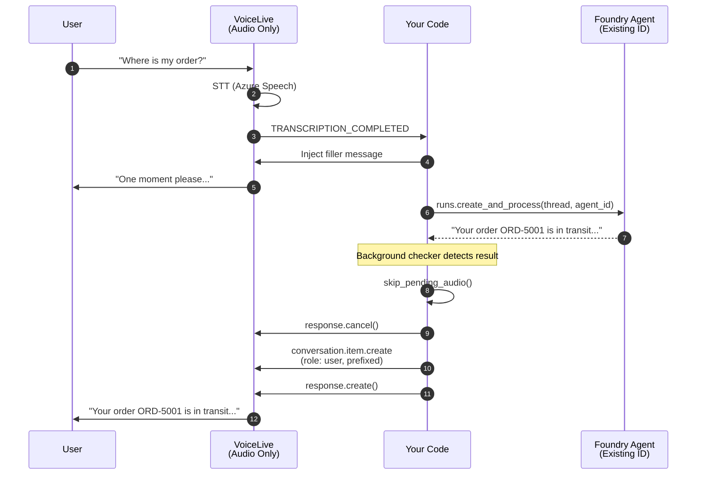

# Step 2: Voice Live with Azure AI Foundry Agent (Existing Agent ID)

In this step, **VoiceLive handles only audio** (speech-to-text and text-to-speech). The **Azure AI Foundry Agent** handles reasoning and returns the response. We **do not create** a new agent; we call an **existing agent ID**.

---

## Architecture



## What Changed from Step 1

| Aspect | Step 1 | Step 2 (Foundry Agent) |
|--------|--------|--------|
| VoiceLive session tools | 8 FunctionTool schemas | **None** |
| VoiceLive session instructions | Full agent personality | Minimal ("acknowledge and wait") |
| Event that triggers logic | `FUNCTION_CALL` | **`TRANSCRIPTION_COMPLETED`** |
| Reasoning | Local Python tool dispatch | **Foundry Agent (existing ID)** |
| New dependency | -- | **`azure-ai-agents`** |
| Conversation memory | VoiceLive session | **Foundry Agent thread** |

## Foundry Agent Flow

```python
from azure.ai.agents import AgentsClient
from azure.ai.agents.models import MessageRole
from azure.identity import DefaultAzureCredential

client = AgentsClient(
    endpoint=agent_endpoint,
    credential=DefaultAzureCredential(),
)
thread = client.threads.create()

client.messages.create(
    thread_id=thread.id,
    role=MessageRole.USER,
    content=user_text,
)

run = client.runs.create_and_process(
    thread_id=thread.id,
    agent_id=agent_id,
)
```

## Setup

```bash
cd voiceAgentAgentic
cp .env.example .env   # fill in VoiceLive + Foundry Agent values

pip install -r requirements.txt

az login

cd 02_agent_tools
python main.py
```

## Required environment variables

| Variable | Purpose |
|---|---|
| `AZURE_VOICELIVE_ENDPOINT` | Voice Live API endpoint |
| `AZURE_VOICELIVE_API_KEY` | Voice Live API key (or use token auth) |
| `AZURE_EXISTING_AGENT_ID` | Existing Foundry agent ID |
| `AZURE_EXISTING_AIPROJECT_ENDPOINT` | Foundry **project** endpoint |

**Fallbacks supported:**
- `AZURE_AGENT_ENDPOINT` + `AZURE_AGENT_PROJECT` (used to build project endpoint)

## What to Notice

- VoiceLive is **audio-only** in this step
- We call an **existing Foundry agent** (no creation/deletion)
- The result is injected via a user message with a prefix (no pre-generated assistant message)
