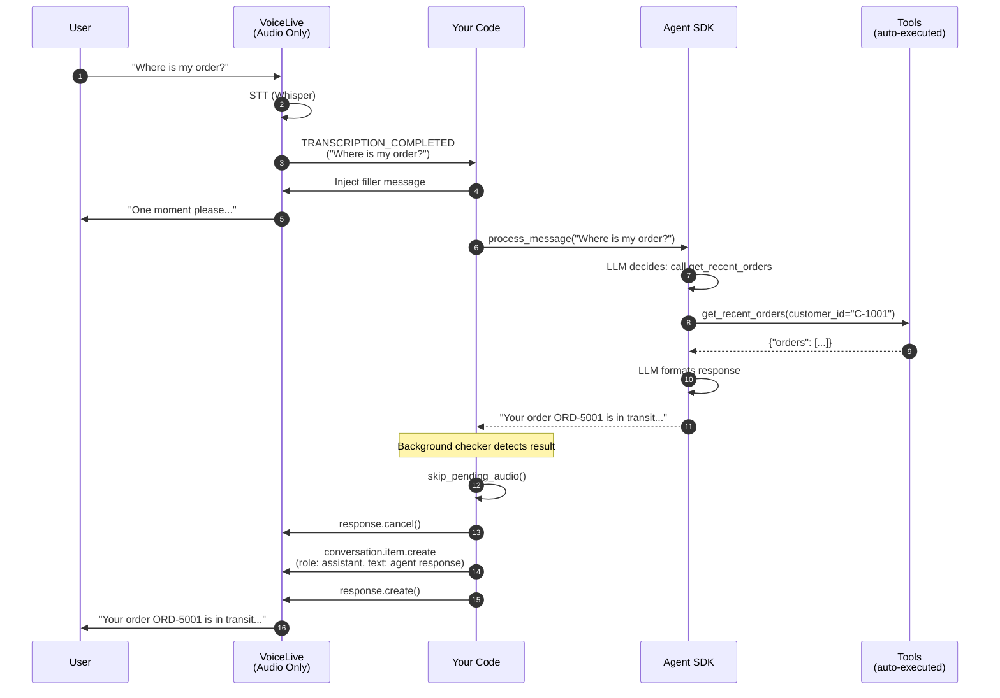

# Step 2: Voice Live with Azure AI Agent SDK

In this step, **VoiceLive handles only audio** (speech-to-text and text-to-speech). The **Azure AI Agent SDK** handles reasoning, tool selection, and tool execution.

This is the production pattern: separate audio processing from intelligence.

---

## Architecture



## What Changed from Step 1

| Aspect | Step 1 | Step 2 |
|--------|--------|--------|
| VoiceLive session tools | 8 FunctionTool schemas | **None** |
| VoiceLive session instructions | Full agent personality | Minimal ("acknowledge and wait") |
| Event that triggers logic | `FUNCTION_CALL` | **`TRANSCRIPTION_COMPLETED`** |
| Tool execution | Local Python dispatch | **Agent SDK auto-execution** |
| New dependency | -- | **`azure-ai-agents` + AgentsClient** |
| Conversation memory | VoiceLive session | **Agent thread (persistent)** |

### Code Diff Highlights

**Session setup** -- No tools on VoiceLive:
```python
# Step 1: tools registered on VoiceLive
session_config = RequestSession(
    tools=tools,                    # <-- 8 FunctionTool schemas
    tool_choice=ToolChoiceLiteral.AUTO,
    ...
)

# Step 2: no tools on VoiceLive
session_config = RequestSession(
    # tools=...                     # <-- REMOVED
    # tool_choice=...               # <-- REMOVED
    input_audio_transcription=AudioInputTranscriptionOptions(model="whisper-1"),
    ...
)
```

**Event handling** -- Different trigger:
```python
# Step 1: react to tool call events
elif event.type == ServerEventType.CONVERSATION_ITEM_CREATED:
    if event.item.type == ItemType.FUNCTION_CALL:
        # Execute tool locally...

# Step 2: react to transcription events
elif event.type == ServerEventType.CONVERSATION_ITEM_INPUT_AUDIO_TRANSCRIPTION_COMPLETED:
    transcript = event.transcript
    # Send to Agent SDK...
```

**Tool execution** -- SDK handles it:
```python
# Step 1: manual dispatch
tool_func = TOOL_DISPATCH[function_name]
result = tool_func(**args)

# Step 2: SDK auto-executes tools
client.enable_auto_function_calls(toolset)   # one-time setup
run = client.runs.create_and_process(...)    # SDK calls tools internally
```

## The `asyncio.to_thread()` Bridge

The Agent SDK (`azure-ai-agents`) is **synchronous** -- `runs.create_and_process()` blocks until the agent finishes. Since VoiceLive runs in an async event loop, we bridge with:

```python
response = await asyncio.to_thread(
    self.agent_bridge.process_message, transcript
)
```

This runs the blocking agent call in a separate thread without freezing the audio loop.

## Setup

```bash
cd voiceAgentAgentic
cp .env.example .env   # fill in ALL credentials (Voice Live + Agent)
pip install -r requirements.txt
cd 02_agent_tools
python main.py
```

**Required environment variables for this step:**

| Variable | Purpose |
|---|---|
| `AZURE_VOICELIVE_ENDPOINT` | Voice Live API endpoint |
| `AZURE_VOICELIVE_API_KEY` | Voice Live API key |
| `AZURE_AGENT_ENDPOINT` | AI Foundry endpoint |
| `AZURE_AGENT_PROJECT` | AI Foundry project name |
| `AZURE_AGENT_MODEL` | Model deployment (e.g. `gpt-4.1`) |

## What to Notice

- The VoiceLive session has **zero tools** -- it only does audio
- The Agent SDK creates an agent at startup and deletes it on exit
- `asyncio.to_thread()` bridges the sync SDK with the async event loop
- A `processing_lock` prevents concurrent agent calls
- The agent maintains full conversation history in its thread
