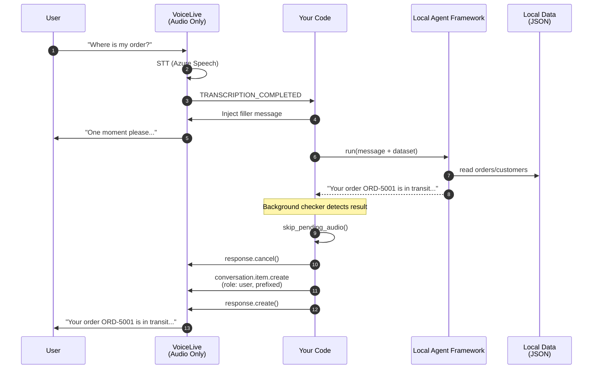

# Step 2: Voice Live with Local Agent Framework

In this step, **VoiceLive handles only audio** (speech-to-text and text-to-speech). A **local Agent Framework** agent handles reasoning and generates responses from a **local JSON dataset**.

This keeps the audio pipeline in Azure, but removes the cloud Agent Service from the loop.

---

## Architecture



## What Changed from Step 1

| Aspect | Step 1 | Step 2 (Local Agent) |
|--------|--------|--------|
| VoiceLive session tools | 8 FunctionTool schemas | **None** |
| VoiceLive session instructions | Full agent personality | Minimal ("acknowledge and wait") |
| Event that triggers logic | `FUNCTION_CALL` | **`TRANSCRIPTION_COMPLETED`** |
| Reasoning | Local Python tool dispatch | **Local Agent Framework + JSON data** |
| New dependency | -- | **`agent-framework` (pre-release)** |
| Conversation memory | VoiceLive session | **Stateless (per request)** |

## Local Agent Framework Flow

```python
from agent_framework.azure import AzureAIClient

client = AzureAIClient(
    credential=AzureCliCredential(),
    project_endpoint=project_endpoint,
    model_deployment_name=model_deployment,
)
agent = client.as_agent(instructions=system_prompt)

result = await agent.run(message_with_dataset)
```

## Setup

```bash
cd voiceAgentAgentic
cp .env.example .env   # fill in ALL credentials (Voice Live + AI project)

pip install -r requirements.txt
pip install --pre agent-framework

az login

cd 02_agent_tools
python main.py
```

## Required environment variables

| Variable | Purpose |
|---|---|
| `AZURE_VOICELIVE_ENDPOINT` | Voice Live API endpoint |
| `AZURE_VOICELIVE_API_KEY` | Voice Live API key (or use token auth) |

**Optional overrides (only if you want to change the defaults):**
- `AZURE_AI_PROJECT_ENDPOINT` or `AZURE_EXISTING_AIPROJECT_ENDPOINT`
- `AZURE_AI_MODEL_DEPLOYMENT_NAME` or `MODEL_DEPLOYMENT_NAME`

## What to Notice

- VoiceLive is **audio-only** in this step
- The agent runs locally and reads `data/orders.json`
- No cloud agent is created or managed
- A `processing_lock` prevents concurrent agent calls
- The result is injected via a user message with a prefix (no pre-generated assistant message)
