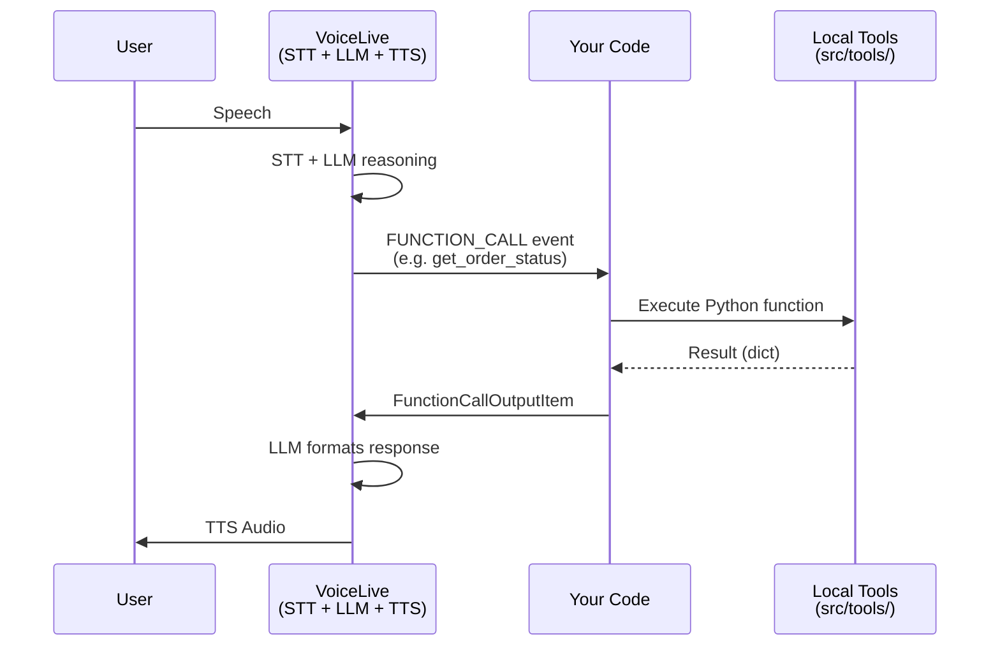
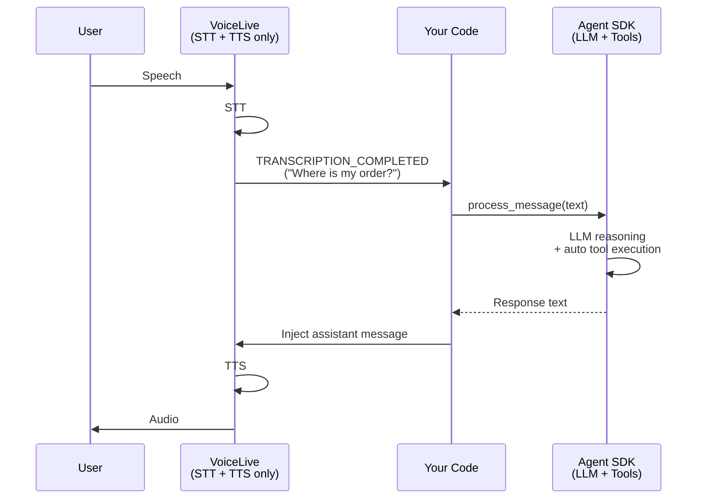

# Voice Agent Workshop: From Local Tools to Agent SDK

This workshop teaches you how to build a voice-powered customer service agent in two progressive steps. Both examples use the **Azure Voice Live API** for real-time audio, but differ in how tools are handled.

---

## Overview

| | Step 1: Local Tools | Step 2: Agent SDK |
|---|---|---|
| **Folder** | [`01_local_tools/`](01_local_tools/) | [`02_agent_tools/`](02_agent_tools/) |
| **Who decides tool calls** | VoiceLive's realtime model | Azure AI Agent Service |
| **Tools registered where** | On VoiceLive session | On Agent SDK `ToolSet` |
| **Tool execution** | Local Python dispatch | SDK auto-execution |
| **Event trigger** | `FUNCTION_CALL` events | `TRANSCRIPTION_COMPLETED` event |
| **Conversation memory** | VoiceLive session only | Agent thread (persistent, multi-turn) |
| **Azure resources needed** | Voice Live API | Voice Live API + AI Foundry Agent Service |
| **Model for reasoning** | `gpt-realtime` | `gpt-4.1` (or any deployed model) |

---

## Architecture Comparison

### Step 1: VoiceLive Controls Everything



### Step 2: VoiceLive = Audio Only, Agent = Brain



---

## Why Agent SDK? (Step 1 vs Step 2)

Step 1 works well for simple scenarios, but Step 2 with the Agent SDK provides:

- **Better models for reasoning** -- Use `gpt-4.1` for tool selection instead of the realtime model
- **Persistent conversation threads** -- The agent remembers the full conversation across turns
- **Centralized tool management** -- Register tools once on the agent, reuse across channels (voice, chat, API)
- **Auto function calling** -- The SDK handles tool execution, parameter extraction, and result injection
- **Logging and monitoring** -- Agent runs are tracked in Azure AI Foundry portal
- **Separation of concerns** -- VoiceLive handles audio quality, Agent handles intelligence

---

## Tools Available (Both Steps)

Both examples use the same 8 tools from [`src/tools/`](../src/tools/):

| Tool | Purpose |
|---|---|
| `identify_customer` | Look up customer by phone number (CRM) |
| `get_customer_details` | Get full customer profile |
| `check_availability` | Check appointment slots for a date |
| `book_appointment` | Reserve an appointment |
| `get_recent_orders` | Get a customer's order history |
| `get_order_status` | Check a specific order's status |
| `create_ticket` | Open a support ticket |
| `get_ticket_status` | Check ticket progress |

All tools use mock data from `src/tools/base_tool.py`. Replace with real API calls for production.

---

## Quick Start

### Prerequisites

- Python 3.10+
- A microphone and speakers (or headset)
- Azure AI Foundry resource with Voice Live API enabled
- For Step 2: Azure AI Foundry Agent Service access

### 1. Install Dependencies

```bash
cd voiceAgentAgentic
pip install -r requirements.txt
```

> **PyAudio note:** On macOS: `brew install portaudio`. On Ubuntu: `sudo apt-get install portaudio19-dev`.

### 2. Configure Environment

```bash
cp .env.example .env
# Edit .env with your Azure credentials
```

### 3. Run Step 1

```bash
cd 01_local_tools
python main.py
```

### 4. Run Step 2

Make sure `AZURE_AGENT_ENDPOINT`, `AZURE_AGENT_PROJECT`, and `AZURE_AGENT_MODEL` are set in `.env`.

```bash
cd 02_agent_tools
python main.py
```

---

## What to Try

1. **Ask about orders:** "Was habe ich bestellt?" or "Wo ist meine Bestellung?"
2. **Book an appointment:** "Ich moechte einen Termin fuer naechste Woche."
3. **File a complaint:** "Meine Lieferung war beschaedigt."
4. **Multi-turn:** Ask a follow-up question after the first answer.

Compare how both steps handle the same requests. Notice that Step 2 maintains better context across turns because of the persistent agent thread.

---

## License

See the [MIT License](../LICENSE) in the root of this repository.
